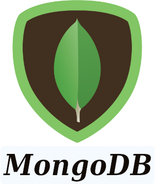

## Hi there! My name is Daniel (aka Cyrano)
##### (there's a why I use Cyrano as a dev nickname, but it's beyond this quick intro 🙂)

---------

### Who am I

- Actually, I **still don't know** (but I'm ever working on figuring that out 🌙 ✨)
- I live in Brazil and I've had **diverse job experiences** (including abroad) for a fair long time...
- ...before starting a **full-stack developer course** at [**Trybe**](https://www.betrybe.com/) *(due jun2021)*.
- I'm currently open for job opportunities as a **beginner web developer**.

---------
### Skills
<table>
  <tr>
    <th>Languages</th>
    <th>Libs, services, software</th>
    <th>Tools</th>
  </tr>
  <tbody>
    <tr>
      <td>
        
        
        
      </td>
      <td>
        
        
        
        
        
      </td>
      <td>
        
        
        
        
      </td>
    </tr>
  </tbody>
</table>

----------

### Contact me

